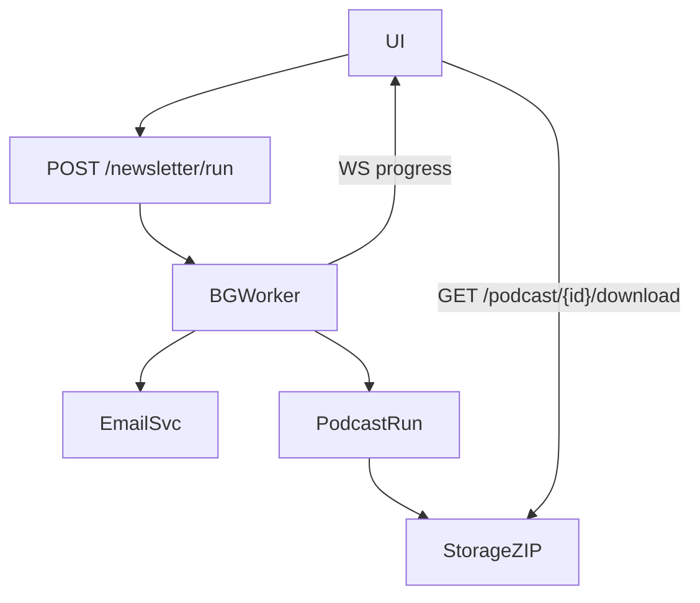

# Theseus Insight – Graphical User Interface (GUI) Product Requirements Document (v0.2)

> **Scope note:** This PRD covers *Phase 1* — adding a **browser‑based GUI** that runs locally, served by a Node/Next.js dev server and talking to the existing FastAPI backend + SQLite storage. Containerisation and remote deployment will be defined in a later phase.

---

## 1 · Goals & Non‑Goals

|                | Goals                                                                                                                                                                                                                                                                                                                   | Non‑Goals                                                                                                                                               |
| -------------- | ----------------------------------------------------------------------------------------------------------------------------------------------------------------------------------------------------------------------------------------------------------------------------------------------------------------------- | ------------------------------------------------------------------------------------------------------------------------------------------------------- |
| **User Value** | • Provide a polished point‑and‑click experience so non‑technical users can harvest papers, generate newsletters & podcasts, and review results.<br>• Reduce reliance on CLI and manual JSON edits.                                                                                                                      | • Cloud/SaaS multi‑tenant hosting.<br>• Mobile‑first UX (desktop‑first for Phase 1).<br>• Full account management / OAuth (assume single‑user desktop). |
| **Technical**  | • Build the UI with **Next.js 14 (App Router) + React 18**, written in **TypeScript**.<br>• Use **shadcn/ui** (Radix primitives + Tailwind CSS) for components & styling.<br>• Keep the backend exactly as‑is (FastAPI) and communicate over REST/WebSockets.<br>• Hot‑reload dev workflow: `pnpm install && pnpm dev`. | • Heavy CI/CD & Docker orchestration.<br>• Design‑system theming beyond shadcn defaults.<br>• Data‑visualisation polish (simple first).                 |

---

## 2 · Personas & Primary Use‑Cases

| Persona           | Top Jobs‑To‑Be‑Done                                                                                                                                                                     |
| ----------------- | --------------------------------------------------------------------------------------------------------------------------------------------------------------------------------------- |
| **Research Lead** | • Curate weekly newsletter from selected date range.<br>• Receive email + (optional) podcast audio based on newsletter.<br>• Filter historical paper scores to justify topic selection. |
| **Podcast Host**  | • Upload PDFs / arXiv URLs → auto‑generated script & TTS.<br>• Tweak intro music & visualiser params.<br>• Download final assets as ZIP.                                                |
| **Ops Engineer**  | • Verify background runs (log table) for failures.<br>• Update model paths or orchestration JSON in **Settings**.                                                                       |

---

## 3 · Technology Stack

| Layer              | Choice                                         | Notes                                                           |
| ------------------ | ---------------------------------------------- | --------------------------------------------------------------- |
| Frontend framework | **Next.js 14 (App Router)**                    | File‑based routing, built‑in SSR/SSG if needed.                 |
| UI components      | **shadcn/ui**                                  | Radix primitives, Tailwind utility classes; dark‑mode included. |
| Styling            | **Tailwind v3**                                | Already integrated via shadcn generator.                        |
| State‑management   | React Context + `react‑query` (TanStack Query) | Handles server‑state caching + optimistic updates.              |
| Icons              | **lucide‑react**                               | Lightweight SVG icon set.                                       |
| Build tool         | **Vite (via Next.js turbo)**                   | Out of the box with Next 14.                                    |
| Package manager    | **pnpm**                                       | Faster installs, workspace‑friendly.                            |
| Communication      | REST + WebSocket                               | Proxy to FastAPI on `localhost:8000`.                           |

---

## 4 · Functional Requirements

### 4.1 Site‑wide

1. **Persistent Sidebar Navigation**

   * Width ≈ 240 px, collapsible (<1024 px auto‑collapses).
   * Active link highlighted; uses `next/link` for client‑side route transitions.
   * Main content area (`<main className="flex‑1 p‑6">`) fills remaining space and starts at top‑left (no forced centring).
2. **Global Feedback**

   * Toast component from shadcn (`<ToastProvider>` + `<Toast>`).
   * WebSocket hook (`useRunProgress`) streams node‑level status into progress bars / DAG viewer.
3. **Settings Hydration**

   * On app load call `GET /settings` → populate React context; `PUT /settings` on save.

### 4.2 Pages

| ID                          | Route         | Purpose                                | Core UI Elements                                                                                                                                                                                                                                                                                                                                                              | Backend Calls                                                               |
| --------------------------- | ------------- | -------------------------------------- | ----------------------------------------------------------------------------------------------------------------------------------------------------------------------------------------------------------------------------------------------------------------------------------------------------------------------------------------------------------------------------- | --------------------------------------------------------------------------- |
| **P‑01 Settings**           | `/settings`   | Edit all user‑configurable values.     | • Tabs inside `Card`: **Research Interests, Models, Email, Misc**.<br>• `<Textarea>` for interests list.<br>• `<Select>`s for model paths (populated from backend scan).<br>• Monaco‑powered JSON editor for orchestration string.<br>• "Send test email" button.                                                                                                             | `GET/PUT /settings`                                                         |
| **P‑02 Newsletter Builder** | `/newsletter` | Generate newsletter for a date range.  | • `DateRangePicker` *or* "last N days" `<InputNumber>`.<br>• Inline overrides for research interests & per‑stage models.<br>• Email recipient multi‑select (creatable tags).<br>• Checkbox "Also create podcast" → conditional accordion for script/TTS options & intro music upload (accepts mp3/wav).<br>• **Run** button → status panel with node timeline (vertical DAG). | `POST /newsletter/run` + `WS /newsletter/progress`                          |
| **P‑03 Podcast Builder**    | `/podcast`    | Create podcast from PDFs / arXiv URLs. | • `Dropzone` for files, `<Textarea>` for URLs (newline‑separated).<br>• Model selectors (script & TTS).<br>• Toggle "Add visualisation" → visualiser param form (FPS, colour‑scheme, intro/outro length).<br>• **Run & Download** button – shows link when done.                                                                                                              | `POST /podcast/run` + `WS /podcast/progress` + `GET /podcast/{id}/download` |
| **P‑04 Paper Ratings**      | `/papers`     | Browse historical paper scores.        | • `DataTable` with columns: Title (link), Abstract (ellipsis expandable), Score, Date.<br>• Filters in header bar: date range picker + score slider.<br>• Infinite scroll via react‑query `useInfiniteQuery`.                                                                                                                                                                 | `GET /papers` with query params                                             |
| **P‑05 Run Log**            | `/runs`       | Inspect historical runs.               | • `DataTable` with columns: Date, Pipeline, Status badge, Duration, Artifact link.<br>• Default sort = desc(date).<br>• Date filter (`<Calendar />`).                                                                                                                                                                                                                         | `GET /runs` with date filters                                               |

---

## 5 · Development Workflow

1. **Bootstrap**

   ```bash
   pnpm create next-app theseus-gui --ts --tailwind --eslint --src-dir
   cd theseus-gui
   npx shadcn-ui@latest init
   pnpm add @tanstack/react-query lucide-react socket.io-client
   ```
2. **Local backend proxy** – add `next.config.js` rewrite:

   ```js
   module.exports = {
     async rewrites() {
       return [{ source: '/api/:path*', destination: 'http://localhost:8000/:path*' }]
     },
   }
   ```
3. **Run**

   ```bash
   # in one terminal
   pnpm dev  # Next.js on :3000

   # in another
   uvicorn backend.main:app --reload  # FastAPI on :8000
   ```
4. **Build** – `pnpm build && pnpm start` serves static/server bundle.

---

## 6 · Non‑Functional Requirements

* **Performance:** Time‑to‑Interactive ≤ 1 s on M‑series Mac in dev; background tasks streamed every ≤ 2 s.
* **Accessibility:** All shadcn components ship with Radix accessibility; verify colour contrast AA.
* **Responsiveness:** Sidebar collapses at < 1024 px; layout degrades gracefully to single column.
* **Download Packaging:** Server‑side zipping unchanged (see backend spec). Frontend polls `/podcast/{id}` until `artifact_ready=true`.
* **Error Handling:** HTTP errors → toast, `react‑query` handles retries; WS disconnects → exponential backoff.

---

## 7 · Data Contracts / Schema Impacts

| Table      | Impact                                                                     |
| ---------- | -------------------------------------------------------------------------- |
| `settings` | Add `orchestration_json`, `intro_music_path` (nullable).                   |
| `runs`     | Add `pipeline_type` enum (`newsletter`, `podcast`), `artifact_path` (zip). |
| `papers`   | No change.                                                                 |

---

## 8 · API Additions (FastAPI)



---

## 9 · Acceptance Criteria

1. Running `pnpm dev` starts the UI at `http://localhost:3000` and sidebar never centres main content.
2. Creating a newsletter (podcast option off) logs a run and sends email; run appears in *Run Log*.
3. Podcast builder returns a ZIP containing script + mp3 when visualiser is unchecked and adds `video.mp4` when checked.
4. Filtering Paper Ratings by score/date updates table within < 300 ms.

---

## 10 · Risks & Mitigations

| Risk                       | Likelihood | Impact | Mitigation                                                              |
| -------------------------- | ---------- | ------ | ----------------------------------------------------------------------- |
| JS stack unfamiliarity     | Med        | Med    | Provide template repo + detailed README; leverage shadcn generator.     |
| WebSocket version mismatch | Low        | High   | Use `socket.io` on both ends or native WS with protocol version pinned. |

---

## 11 · Open Questions

1. Should we SSR any pages (e.g., Paper Ratings) or keep everything client‑side CSR for simplicity?
2. How long should generated ZIPs persist on disk (7 days vs configurable)?
3. Future multi‑user auth: integrate NextAuth or rely on future backend JWT?

*Last updated:* 2025‑05‑12
